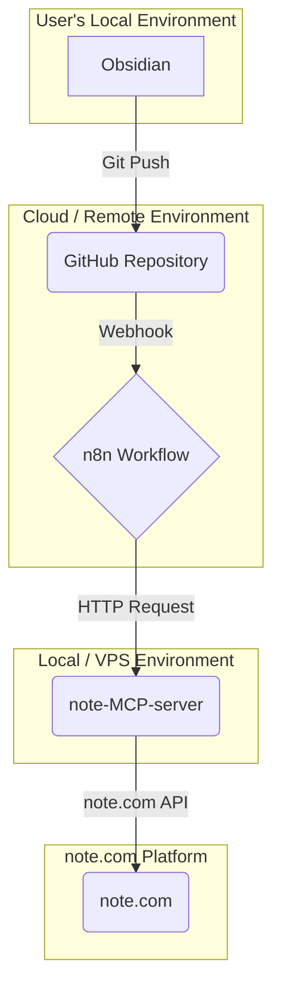

# Obsidian to note.com 自動下書きシステム設計書

## 1. 概要

本ドキュメントは、Obsidianで作成したMarkdownドキュメントを、GitHubリポジトリへのプッシュをトリガーとして、note.comに自動で下書き投稿するシステムのアーキテクチャとオーケストレーションについて記述するものです。

本システムは、`note-MCP-server` とワークフロー自動化ツール `n8n` を中核に据えて構築します。

## 2. システム構成図



## 3. コンポーネント詳細

| コンポーネント | 役割 | 実装詳細 |
| :--- | :--- | :--- |
| **Obsidian** | 記事の作成・編集 | Markdown形式で記事を作成。Frontmatterにタイトルやタグなどのメタデータを記述。 |
| **GitHub** | 記事のバージョン管理とトリガー | ObsidianからのGitプッシュを受け取り、変更をn8nにWebhookで通知する。 |
| **n8n** | オーケストレーション | Webhookをトリガーにワークフローを実行。Markdownの処理、`note-MCP-server`へのリクエスト送信を担当。 |
| **note-MCP-server** | note.com APIラッパー | n8nからのリクエストを受け、note.comの認証とAPIコールを実行し、下書きを作成・更新する。 |
| **note.com** | 投稿プラットフォーム | 最終的な下書きが保存される場所。 |

## 4. データフローと処理シーケンス

1.  **記事作成 (Obsidian)**: ユーザーはObsidianで記事をMarkdown形式で執筆します。ファイルの先頭には、以下のようなFrontmatterを記述してメタデータを管理します。

    ```yaml
    ---
    title: "私の新しい記事のタイトル"
    tags: ["技術", "プログラミング", "自動化"]
    note_id: null  # 初回投稿時はnullまたは空
    ---

    ## はじめに
    これは記事の本文です...
    ```

2.  **変更のプッシュ (GitHub)**: ユーザーがObsidianからGitHubリポジトリにコミット＆プッシュすると、GitHub ActionsまたはリポジトリのWebhook設定がこれを検知します。

3.  **ワークフロー起動 (n8n)**: GitHubから送信されたWebhookをn8nの `Webhook` ノードが受信し、ワークフローを開始します。ペイロードには、変更されたファイルの情報が含まれます。

4.  **ファイル内容の取得 (n8n)**: n8nの `GitHub` ノードを使い、Webhookペイロードに含まれるファイルパスを元に、GitHubリポジトリからMarkdownファイルの最新の内容を取得します。

5.  **データ抽出と変換 (n8n)**: n8nの `Code` ノード（または `Function` ノード）でJavaScriptを実行し、以下の処理を行います。
    *   Frontmatter部分をパースして、`title`, `tags`, `note_id` を抽出します。
    *   Markdownの本文をHTML形式に変換します。（`marked`などのライブラリを利用）

6.  **下書き投稿リクエスト (n8n)**: n8nの `HTTP Request` ノードを使い、`note-MCP-server` の `post-draft-note` ツールを呼び出します。`note-MCP-server` は事前にローカルPCやVPSで起動し、Cloudflare Tunnelなどを利用してn8nからアクセス可能なURLを払い出しておきます。

    *   **URL**: `https://<your-tunnel-url>/mcp`
    *   **Method**: `POST`
    *   **Body (JSON)**:
        ```json
        {
            "jsonrpc": "2.0",
            "method": "tools/call",
            "params": {
                "tool_name": "post-draft-note",
                "inputs": {
                    "title": "(抽出したタイトル)",
                    "body": "(変換後のHTML)",
                    "tags": ["技術", "プログラミング", "自動化"],
                    "id": "(抽出したnote_id、存在しない場合はnull)"
                }
            },
            "id": "1"
        }
        ```

7.  **記事IDの保存 (n8n & GitHub)**: `post-draft-note` が成功すると、レスポンスとしてnote.comの記事IDが返却されます。初回投稿の場合（`note_id`がnullだった場合）、n8nはGitHub APIを呼び出して、元のMarkdownファイルのFrontmatterにある `note_id` をこの新しいIDで更新します。これにより、次回以降のプッシュは「更新」として扱われます。

8.  **完了通知 (n8n)**: (任意) 処理の成功または失敗を、n8nの `Slack` ノードや `Discord` ノードなどを使ってユーザーに通知します。

## 5. 前提条件と環境構築

*   **note-MCP-server**: ローカルPCまたはVPSにセットアップし、`.env` ファイルにnote.comの認証情報を設定済みであること。
*   **Cloudflare Tunnel**: `note-MCP-server` をリモートのn8nから安全にアクセスさせるために、Cloudflare Tunnelを設定し、永続的なURLを取得済みであること。
*   **n8n**: クラウド版またはセルフホスト版のn8n環境が利用可能であること。
*   **GitHub**: Webhookが設定可能なリポジトリが存在すること。

この設計により、Obsidianでの執筆体験を損なうことなく、GitHubを介した効率的で自動化されたnote.comへの投稿フローが実現します。
