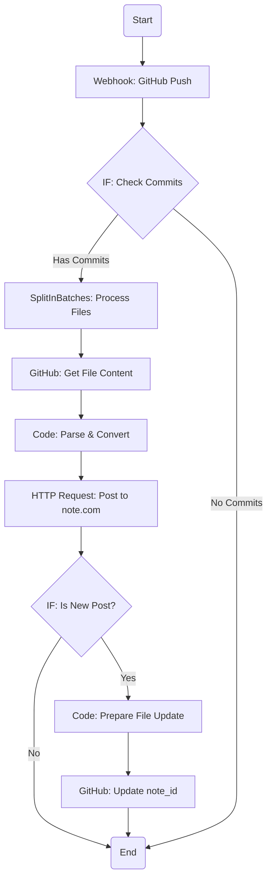

# n8nワークフロー設計とMCP連携ガイド

## 1. ワークフロー概要

このワークフローは、GitHubへのプッシュをトリガーに、変更されたMarkdownファイルを取得し、`note-MCP-server`を経由してnote.comへ下書きを自動投稿・更新します。

### ワークフロー図 (n8n)



## 2. ノード別設定詳細

### Node 1: Webhook

- **Trigger**: `Webhook`
- **HTTP Method**: `POST`
- **Instructions**: このノードをアクティブにすると、Webhook URLが生成されます。このURLをGitHubリポジトリの `Settings` > `Webhooks` に登録します。`Content type` は `application/json` を選択し、`Push` イベントのみをトリガーするように設定します。

### Node 2: IF (変更の有無をチェック)

- **Condition**: `{{ $json.body.commits }}`
- **Operation**: `Is Not Empty`
- **Purpose**: プッシュにコミットが含まれているかを確認し、空のプッシュを無視します。

### Node 3: SplitInBatches

- **Field to Split**: `{{ $json.body.head_commit.modified }}`
- **Batch Size**: `1`
- **Purpose**: 1回のプッシュで複数のファイルが変更された場合に対応するため、変更されたファイルのリストを1つずつに分割して後続のノードで処理します。

### Node 4: GitHub (ファイル取得)

- **Authentication**: `OAuth2` または `Access Token` を設定
- **Resource**: `File`
- **Operation**: `Get`
- **Repository Owner**: `(あなたのGitHubユーザー名)`
- **Repository Name**: `(あなたのリポジトリ名)`
- **File Path**: `{{ $json.fileName }}`  *(SplitInBatchesからの入力)*
- **Output**: ファイルの内容が `content` というキーにBase64エンコードされた文字列として返されます。

### Node 5: Code (パースとHTML変換)

- **Language**: `JavaScript`
- **Input**: `GitHub`ノードの出力
- **Purpose**: ファイルの内容をデコードし、FrontmatterとMarkdown本文を分離・変換します。
- **Code**:

```javascript
// 外部ライブラリの代わりに基本的な関数を使用
const matter = (input) => {
  const match = input.match(/^---\r?\n([\s\S]+?)\r?\n---\r?\n([\s\S]*)/);
  if (!match) return { data: {}, content: input };
  const frontmatter = match[1].split('\n').reduce((acc, line) => {
    const parts = line.split(':');
    const key = parts[0].trim();
    const value = parts.slice(1).join(':').trim();
    if (key) acc[key] = value.replace(/['"]/g, '');
    return acc;
  }, {});
  return { data: frontmatter, content: match[2] };
};

// 簡単なMarkdown to HTML変換
const markdownToHtml = (md) => {
  md = md.replace(/^#\s+(.*)$/gm, '<h1>$1</h1>');
  md = md.replace(/^##\s+(.*)$/gm, '<h2>$1</h2>');
  md = md.replace(/^###\s+(.*)$/gm, '<h3>$1</h3>');
  md = md.replace(/\*\*(.*?)\*\*/g, '<strong>$1</strong>');
  md = md.replace(/\*(.*?)\*/g, '<em>$1</em>');
  md = md.replace(/\n/g, '<br>');
  return md;
};

const base64content = $input.item.json.content;
const decodedContent = Buffer.from(base64content, 'base64').toString('utf-8');

const { data, content } = matter(decodedContent);

const htmlBody = markdownToHtml(content);

// タグを配列に変換
const tags = data.tags ? data.tags.replace(/[\[\]]/g, '').split(',').map(t => t.trim()) : [];

return {
  title: data.title || '無題',
  body: htmlBody,
  tags: tags,
  note_id: data.note_id && data.note_id !== 'null' ? data.note_id : null,
  originalContent: decodedContent
};
```

### Node 6: HTTP Request (note-MCP-server連携)

- **Method**: `POST`
- **URL**: `https://<your-tunnel-url>/mcp` (n8nの環境変数 `NOTE_MCP_SERVER_URL` で管理することを推奨)
- **Send Body**: `true`
- **Body Content Type**: `application/json`
- **Body**:

```json
{
  "jsonrpc": "2.0",
  "method": "tools/call",
  "params": {
    "tool_name": "post-draft-note",
    "inputs": {
      "title": "{{ $json.title }}",
      "body": "{{ $json.body }}",
      "tags": {{ JSON.stringify($json.tags) }},
      "id": "{{ $json.note_id }}"
    }
  },
  "id": "n8n-workflow-{{ $workflow.id }}"
}
```

### Node 7: IF (新規投稿か判断)

- **Condition 1**: `{{ $node["Code"].json.note_id }}`
- **Operation**: `Is Empty`
- **Purpose**: `note_id`が空（新規投稿）の場合のみ、ファイル更新のブランチに進みます。

### Node 8: Code (ファイル更新準備)

- **Language**: `JavaScript`
- **Purpose**: GitHubに書き戻すための新しいファイルコンテンツを作成します。
- **Code**:

```javascript
const originalContent = $input.item.json.originalContent;
const newNoteId = $node["HTTP Request"].json.result.data.key;

// note_idを更新
const updatedContent = originalContent.replace(/note_id:\s*.*/, `note_id: ${newNoteId}`);

return {
  updatedContent: Buffer.from(updatedContent).toString('base64')
};
```

### Node 9: GitHub (ファイル更新)

- **Authentication**: `OAuth2` または `Access Token` を設定
- **Resource**: `File`
- **Operation**: `Update`
- **Repository Owner**: `(あなたのGitHubユーザー名)`
- **Repository Name**: `(あなたのリポジトリ名)`
- **File Path**: `{{ $node["SplitInBatches"].json.fileName }}`
- **Content**: `{{ $json.updatedContent }}`
- **Commit Message**: `[BOT] Update note_id to {{ $node["HTTP Request"].json.result.data.key }}`

## 3. MCP連携のポイント

- **エンドポイント**: `note-MCP-server`を`npm run start:http`で起動し、Cloudflare Tunnel等で払い出された公開URLの末尾に`/mcp`をつけたものがエンドポイントになります。
- **リクエスト形式**: 通信はJSON-RPC 2.0形式のPOSTリクエストで行います。`method`に`tools/call`、`params`に呼び出したいツール名(`post-draft-note`)と引数(`inputs`)を指定します。
- **認証**: `note-MCP-server`側で`.env`ファイルにnote.comの認証情報が設定されていれば、n8nからのリクエスト時に自動で認証が行われます。n8n側で認証情報を保持する必要はありません。
- **更新と新規作成**: `post-draft-note`ツールは、`id`パラメータの有無で新規作成と更新を自動的に判別します。n8nワークフローでは、Frontmatterから読み取った`note_id`をこの`id`パラメータに渡すことで、この挙動を制御します。
