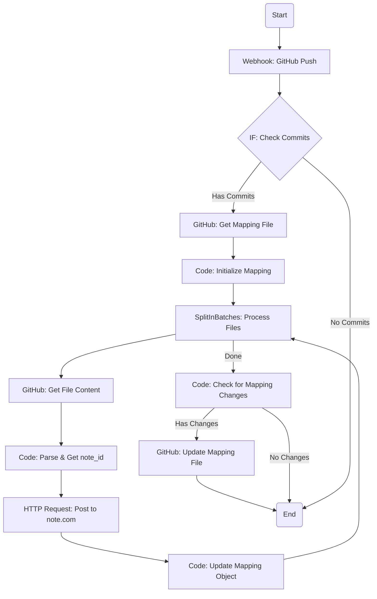

# 改善されたn8nワークフロー設計書

## 1. ワークフロー概要

本ワークフローは、ID管理方式の改善案に基づき、`.note-mapping.json`ファイルを使用してファイルパスとnote IDの対応関係を管理します。これにより、Markdownファイルへの直接書き込みをなくし、Git履歴の汚染やファイル競合を防ぎます。

### 1.1 改善されたワークフロー図 (n8n)



### 1.2 処理フローの改善点

- **マッピングファイルの一元管理**: ワークフローの開始時に`.note-mapping.json`を読み込み、終了時に一度だけ更新します。
- **Markdownファイルの非更新**: 各記事ファイルへの書き戻し処理を完全に廃止します。
- **状態管理**: ワークフロー内でマッピング情報の状態を保持し、最後にまとめてコミットします。

---

## 2. ノード別設定詳細

### Node 1: Webhook

- **設定**: 変更なし。GitHubからのPushイベントを待ち受けます。

### Node 2: IF (変更の有無をチェック)

- **設定**: 変更なし。空のプッシュを無視します。

### Node 3: GitHub (マッピングファイル取得)

- **Resource**: `File`
- **Operation**: `Get`
- **File Path**: `.note-mapping.json`
- **Options**: `Fail on Error`を無効化します。これにより、ファイルが存在しない場合でもワークフローが停止しません。

### Node 4: Code (マッピング初期化)

- **Purpose**: マッピングファイルが存在しない場合に、空のテンプレートを作成します。
- **Code**:

```javascript
// GitHubノードからの入力を取得
const mappingFileInput = $input.item.json;

let mappingData;

if (mappingFileInput.content) {
  // ファイルが存在する場合、デコードしてパース
  const decodedContent = Buffer.from(mappingFileInput.content, 'base64').toString('utf-8');
  mappingData = JSON.parse(decodedContent);
} else {
  // ファイルが存在しない場合、空のテンプレートを作成
  mappingData = {
    version: "1.0",
    last_updated: new Date().toISOString(),
    mappings: {}
  };
}

// 後続のノードで使えるように、マッピングデータを返す
return { mappingData };
```

### Node 5: SplitInBatches

- **Field to Split**: `{{ $json.body.head_commit.modified }}`
- **Batch Size**: `1`
- **Purpose**: 変更されたファイルのリストを1つずつ処理します。

### Node 6: GitHub (ファイル取得)

- **File Path**: `{{ $json.fileName }}`
- **設定**: 変更なし。

### Node 7: Code (パースとnote ID取得)

- **Purpose**: Frontmatterをパースし、マッピングデータから`note_id`を取得します。
- **Code**:

```javascript
// 前段のノードからデータを取得
const fileContent = $input.item.json.content;
const filePath = $input.item.json.fileName; // SplitInBatchesからのファイルパス
const mappingData = $node["Code: Initialize Mapping"].json.mappingData;

// Base64デコード
const decodedContent = Buffer.from(fileContent, 'base64').toString('utf-8');

// Frontmatterパーサー（前回と同じ）
const matter = (input) => { /* ... */ };
const { data, content } = matter(decodedContent);

// HTML変換（前回と同じ）
const markdownToHtml = (md) => { /* ... */ };
const htmlBody = markdownToHtml(content);

// マッピングデータからnote_idを取得
const note_id = mappingData.mappings[filePath] ? mappingData.mappings[filePath].note_id : null;

return {
  filePath: filePath,
  title: data.title || '無題',
  body: htmlBody,
  tags: data.tags ? data.tags.replace(/[\[\]]/g, '').split(',').map(t => t.trim()) : [],
  note_id: note_id
};
```

### Node 8: HTTP Request (note-MCP-server連携)

- **設定**: 変更なし。`note_id`の有無で新規・更新を自動判別します。

### Node 9: Code (マッピングオブジェクト更新)

- **Purpose**: note.comへの投稿成功後、メモリ上のマッピングオブジェクトを更新します。
- **Code**:

```javascript
// 投稿結果と元のデータを取得
const postResult = $input.item.json.result.data;
const originalData = $node["Code: Parse & Get note_id"].json;
let mappingData = $node["Code: Initialize Mapping"].json.mappingData;

const filePath = originalData.filePath;
const newNoteId = postResult.key;

// マッピングオブジェクトを更新または新規作成
if (mappingData.mappings[filePath]) {
  // 更新
  mappingData.mappings[filePath].note_id = newNoteId;
  mappingData.mappings[filePath].title = originalData.title;
  mappingData.mappings[filePath].updated_at = new Date().toISOString();
} else {
  // 新規作成
  mappingData.mappings[filePath] = {
    note_id: newNoteId,
    title: originalData.title,
    created_at: new Date().toISOString(),
    updated_at: new Date().toISOString()
  };
}

// 最終更新日時を更新
mappingData.last_updated = new Date().toISOString();

// 更新されたマッピングデータを返す
return { mappingData };
```

### Node 10: Code (変更の有無をチェック)

- **Purpose**: `SplitInBatches`ループ完了後、元のマッピングデータと更新後のマッピングデータを比較し、変更があった場合のみ後続のノードに進みます。
- **Code**:

```javascript
const initialMapping = $node["Code: Initialize Mapping"].json.mappingData;
const updatedMapping = $node["Code: Update Mapping Object"].json.mappingData;

// JSON文字列に変換して比較
if (JSON.stringify(initialMapping) !== JSON.stringify(updatedMapping)) {
  return { hasChanges: true, updatedMapping: updatedMapping };
} else {
  return { hasChanges: false };
}
```

### Node 11: GitHub (マッピングファイル更新)

- **Resource**: `File`
- **Operation**: `Update`
- **File Path**: `.note-mapping.json`
- **Content**: `{{ JSON.stringify($json.updatedMapping, null, 2) }}` (Base64エンコードが必要な場合は`Code`ノードで処理)
- **Commit Message**: `[BOT] Update .note-mapping.json`
- **Condition**: このノードは、`{{ $node["Code: Check for Mapping Changes"].json.hasChanges }}`が`true`の場合のみ実行されるように設定します。

---

## 3. まとめ

この改善されたワークフローにより、以下の利点がもたらされます。

- **堅牢性の向上**: Markdownファイルへの書き込みがなくなるため、ファイル競合のリスクが根本的に解消されます。
- **Git履歴のクリーン化**: BOTによるコミットが`.note-mapping.json`の更新のみに限定され、記事の変更履歴が追いやすくなります。
- **処理の効率化**: 複数ファイルが更新された場合でも、最後に一度だけマッピングファイルを更新するため、APIコール数が削減され、処理が高速化します。
- **管理の一元化**: `.note-mapping.json`を見るだけで、リポジトリ内の全ファイルの投稿状況が一目でわかります。

この設計は、Obsidian Vaultのような多数のドキュメントを管理する環境において、よりスケーラブルで安定した自動投稿システムを実現します。
