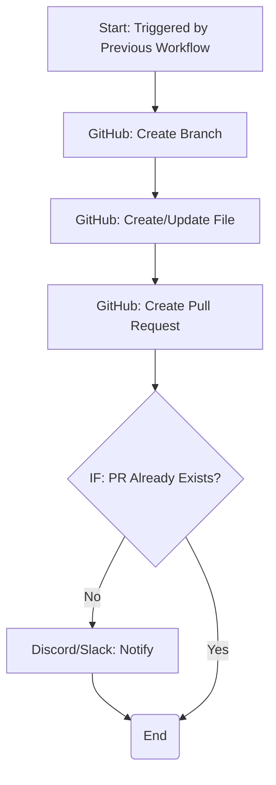

# 逆方向同期: GitHubプルリクエスト/Issue生成と同期フロー設計

## 1. 概要

本ドキュメントでは、前のワークフローで検知・整形されたnote.comの変更内容を、GitHub上でプルリクエスト（PR）またはIssueとして提案し、マージ後の同期を完了させるためのワークフローを設計します。

### 1.1 提案方式の選択: プルリクエスト vs. Issue

| 方式 | メリット | デメリット | 推奨度 |
| :--- | :--- | :--- | :--- |
| **プルリクエスト (PR)** | 変更内容が差分（Diff）で明確にわかる、レビュー・コメントが可能、ワンクリックでマージできる、CI/CDとの連携が容易 | ワークフローがやや複雑になる | ★★★★★ |
| **Issue** | 実装が簡単、変更通知として機能する | 変更内容を手動でコピー＆ペーストする必要がある、マージが手動 | ★★☆☆☆ |

**結論として、変更内容のレビューとマージの容易さから、プルリクエスト方式を強く推奨します。** 本設計書では、PR方式を主軸に説明します。

### 1.2 ワークフロー図 (n8n)



---

## 2. プルリクエスト作成ワークフロー

このワークフローは、前の「変更検知ワークフロー」の完了をトリガーとして実行されます。

### Node 1: Start / Webhook

-   **Trigger**: `Webhook` または `Execute Workflow` ノード
-   **Input**: 前のワークフローから渡されたデータ（`file_path`, `new_content`, `title`, `note_id`, `note_updated_at`）

### Node 2: GitHub (ブランチ作成)

-   **Resource**: `Branch`
-   **Operation**: `Create`
-   **Repository**: `(あなたのリポジトリ)`
-   **Branch Name**: `bot/update-{{ $json.note_id }}` (note IDをベースに一意のブランチ名を作成)
-   **Source Branch**: `main` (またはデフォルトブランチ)

### Node 3: GitHub (ファイル作成/更新)

-   **Resource**: `File`
-   **Operation**: `Create or Update`
-   **Repository**: `(あなたのリポジトリ)`
-   **File Path**: `{{ $json.file_path }}`
-   **Content**: `{{ $json.new_content }}` (Base64エンコードが必要な場合は`Code`ノードで処理)
-   **Branch**: `{{ $node["GitHub: Create Branch"].json.ref }}` (作成したブランチ名)
-   **Commit Message**: `[BOT] Update content from note.com: {{ $json.title }}`

### Node 4: GitHub (プルリクエスト作成)

-   **Resource**: `Pull Request`
-   **Operation**: `Create`
-   **Repository**: `(あなたのリポジトリ)`
-   **Title**: `[note.com Sync] Update: {{ $json.title }}`
-   **Head Branch**: `{{ $node["GitHub: Create Branch"].json.ref }}`
-   **Base Branch**: `main`
-   **Body**:

    ```markdown
    note.comで編集された内容を同期します。

    **記事タイトル**: {{ $json.title }}
    **note ID**: {{ $json.note_id }}

    内容を確認してマージしてください。
    ```

### Node 5: IF (PR重複チェック)

-   **Purpose**: GitHub APIは、同じブランチからのPRが既に存在する場合、エラーを返します。このエラーを検知して、重複通知を防ぎます。
-   **Condition**: `{{ $node["GitHub: Create Pull Request"].error }}`
-   **Operation**: `Contains`
-   **Value**: `A pull request for this branch already exists`

### Node 6: Discord/Slack (通知)

-   **Purpose**: 新しいPRが作成されたことをユーザーに通知します。
-   **Message**:

    ```
    新しいプルリクエストが作成されました。

    **タイトル**: {{ $node["GitHub: Create Pull Request"].json.title }}
    **URL**: {{ $node["GitHub: Create Pull Request"].json.html_url }}
    ```

---

## 3. マージ後の同期フロー

PRがマージされた後の`.note-mapping.json`の更新は、**順方向同期のワークフローを再利用**することで実現します。

### 3.1 仕組み

1.  ユーザーがGitHub上でPRをマージします。
2.  マージは`main`ブランチへのプッシュイベントをトリガーします。
3.  このプッシュイベントを、既存の**順方向同期ワークフロー**（Obsidian → note.com）が検知します。
4.  順方向同期ワークフローは、変更されたMarkdownファイル（`new_content`）を処理します。
5.  `post-draft-note`ツールが呼び出されますが、note.com上のコンテンツは既に最新なので、実質的な変更は発生しません。
6.  重要なのは、ワークフローの最後で**`.note-mapping.json`が更新される**ことです。このとき、`note_updated_at`フィールドが最新の日時に更新されます。

### 3.2 `.note-mapping.json`の更新ロジック（順方向ワークフローの修正）

順方向同期ワークフローの「Code: Update Mapping Object」ノードに、`note_updated_at`を更新するロジックを追加します。

```javascript
// ... 既存のロジック ...

const filePath = originalData.filePath;
const newNoteId = postResult.key;
const noteUpdatedAt = postResult.updated_at; // note.comからのレスポンス

if (mappingData.mappings[filePath]) {
  // ... 更新ロジック ...
  mappingData.mappings[filePath].note_updated_at = noteUpdatedAt; // この行を追加
} else {
  // ... 新規作成ロジック ...
  mappingData.mappings[filePath].note_updated_at = noteUpdatedAt; // この行を追加
}

// ...
```

### 3.3 この方式の利点

-   **ワークフローの再利用**: 新しいワークフローを作成する必要がなく、既存の仕組みを有効活用できます。
-   **状態の整合性**: 順方向と逆方向の両方で同じマッピングファイルが更新されるため、データの整合性が保たれます。
-   **シンプルさ**: マージ後の処理を別途考慮する必要がなく、設計がシンプルになります。

---

## 4. まとめ

本設計により、以下の逆方向同期フローが完成します。

1.  **変更検知**: n8nが定期的にnote.comをチェックし、変更を検知します。
2.  **PR作成**: 変更内容をGitHubのプルリクエストとして自動作成します。
3.  **レビュー＆マージ**: ユーザーがGitHub上で変更内容を確認し、マージします。
4.  **状態同期**: マージをトリガーに既存の順方向ワークフローが実行され、`.note-mapping.json`が最新の状態に更新されます。

この仕組みにより、note.comでの手動編集とObsidianでの編集を、安全かつ効率的に両立させることが可能になります。
