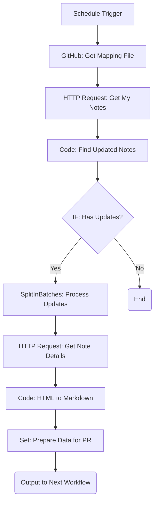

# 逆方向同期: 変更検知とデータ取得ワークフロー設計

## 1. ワークフロー概要

本ワークフローは、n8nの定期実行トリガーによって起動し、note.com上の下書きの変更を検知して、その内容をGitHubに反映するための前処理を行います。

### 1.1 ワークフロー図 (n8n)



### 1.2 処理フロー

1.  **定期起動**: n8nの`Schedule Trigger`が設定された間隔（例: 1時間ごと）でワークフローを開始します。
2.  **マッピングファイル取得**: GitHubリポジトリから`.note-mapping.json`を読み込み、現在の同期状態を把握します。
3.  **下書き一覧取得**: note-MCP-serverの`get-my-notes`ツールを呼び出し、note.com上の全下書き記事のメタデータ（`note_id`, `updated_at`など）を取得します。
4.  **変更検知**: 取得した下書き一覧とマッピングファイルを比較し、note.com側で更新された記事を特定します。
5.  **詳細データ取得**: 更新があった記事について、`get-note`ツールでHTML形式の本文を含む詳細データを取得します。
6.  **Markdown変換**: 取得したHTML本文をMarkdown形式に変換します。
7.  **データ準備**: 後続のPR作成ワークフローに渡すためのデータを整形します。

---

## 2. ノード別設定詳細

### Node 1: Schedule Trigger

-   **Trigger Type**: `Schedule`
-   **Interval**: `Every 1 Hour` (ユーザーのニーズに合わせて調整)

### Node 2: GitHub (マッピングファイル取得)

-   **Resource**: `File`
-   **Operation**: `Get`
-   **File Path**: `.note-mapping.json`
-   **Options**: `Fail on Error`を無効化します。

### Node 3: HTTP Request (下書き一覧取得)

-   **Method**: `POST`
-   **URL**: `{{ $env.NOTE_MCP_SERVER_URL }}`
-   **Body (JSON)**:

    ```json
    {
      "jsonrpc": "2.0",
      "method": "tools/call",
      "params": {
        "tool_name": "get-my-notes",
        "inputs": {
          "type": "draft"
        }
      },
      "id": "n8n-reverse-sync-{{ $workflow.id }}"
    }
    ```

### Node 4: Code (変更検知)

-   **Purpose**: note.comの更新日時とマッピングファイルの更新日時を比較し、変更があった記事をリストアップします。
-   **Code**:

    ```javascript
    const myNotes = $input.item.json.result.data.notes;
    const mappingData = $node["GitHub: Get Mapping File"].json.content ? JSON.parse(Buffer.from($node["GitHub: Get Mapping File"].json.content, 'base64').toString('utf-8')) : { mappings: {} };

    const updatedNotes = [];

    // マッピングを note_id -> file_path の形式に変換
    const noteIdToPathMap = Object.entries(mappingData.mappings).reduce((acc, [path, data]) => {
      if (data.note_id) {
        acc[data.note_id] = { path, ...data };
      }
      return acc;
    }, {});

    for (const note of myNotes) {
      const mappingInfo = noteIdToPathMap[note.key];
      if (!mappingInfo) {
        // マッピングに存在しないnoteはスキップ
        continue;
      }

      const noteUpdatedAt = new Date(note.updated_at);
      const mappingNoteUpdatedAt = new Date(mappingInfo.note_updated_at || 0);

      // note.comの更新日時の方が新しい場合、変更ありと判断
      if (noteUpdatedAt > mappingNoteUpdatedAt) {
        updatedNotes.push({
          note_id: note.key,
          file_path: mappingInfo.path,
          note_updated_at: note.updated_at
        });
      }
    }

    return updatedNotes;
    ```

### Node 5: IF (変更の有無をチェック)

-   **Condition**: `{{ $node["Code: Find Updated Notes"].json.length }}`
-   **Operation**: `Is Not Empty`

### Node 6: SplitInBatches

-   **Field to Split**: `{{ $node["Code: Find Updated Notes"].json }}`
-   **Batch Size**: `1`

### Node 7: HTTP Request (記事詳細取得)

-   **Method**: `POST`
-   **URL**: `{{ $env.NOTE_MCP_SERVER_URL }}`
-   **Body (JSON)**:

    ```json
    {
      "jsonrpc": "2.0",
      "method": "tools/call",
      "params": {
        "tool_name": "get-note",
        "inputs": {
          "noteId": "{{ $json.note_id }}"
        }
      },
      "id": "n8n-reverse-sync-{{ $workflow.id }}"
    }
    ```

### Node 8: Code (HTML→Markdown変換)

-   **Purpose**: note.comから取得したHTML本文をMarkdownに変換します。ここでは簡易的な変換処理を実装します。（より高精度な変換には`turndown`などのライブラリが必要です）
-   **Code**:

    ```javascript
    const noteData = $input.item.json.result.data;
    const htmlBody = noteData.body;

    // 簡易的なHTML to Markdown変換
    let markdownBody = htmlBody
      .replace(/<h1[^>]*>(.*?)<\/h1>/gi, '# $1\n\n')
      .replace(/<h2[^>]*>(.*?)<\/h2>/gi, '## $1\n\n')
      .replace(/<h3[^>]*>(.*?)<\/h3>/gi, '### $1\n\n')
      .replace(/<p[^>]*>(.*?)<\/p>/gi, '$1\n\n')
      .replace(/<strong[^>]*>(.*?)<\/strong>/gi, '**$1**')
      .replace(/<em[^>]*>(.*?)<\/em>/gi, '*$1*')
      .replace(/<br\s*\/?>/gi, '\n')
      .replace(/<a href="(.*?)"[^>]*>(.*?)<\/a>/gi, '[$2]($1)')
      .replace(/<[^>]+>/g, ''); // 残りのHTMLタグを削除

    // Frontmatterを再構築
    const frontmatter = `---
title: "${noteData.name}"
tags: [${noteData.hashtags.map(t => `"${t.hashtag.name}"`).join(', ')}]
---

`;

    const newMarkdownContent = frontmatter + markdownBody;

    return {
      newMarkdownContent: newMarkdownContent,
      title: noteData.name,
      note_id: noteData.key
    };
    ```

### Node 9: Set (データ準備)

-   **Purpose**: 後続のワークフローで使いやすいように、ここまでの処理で得られたデータを統合します。
-   **Keep Only Set**: `true`
-   **Values**:
    -   `file_path`: `{{ $node["SplitInBatches"].json.file_path }}`
    -   `new_content`: `{{ $node["Code: HTML to Markdown"].json.newMarkdownContent }}`
    -   `title`: `{{ $node["Code: HTML to Markdown"].json.title }}`
    -   `note_id`: `{{ $node["Code: HTML to Markdown"].json.note_id }}`
    -   `note_updated_at`: `{{ $node["SplitInBatches"].json.note_updated_at }}`

---

## 3. 次のフェーズへの連携

このワークフローの最終的な出力は、`Set`ノードで整形されたJSONオブジェクトのリストです。各オブジェクトには、GitHubでPR/Issueを作成するために必要な情報（ファイルパス、新しいMarkdownコンテンツ、タイトルなど）が含まれています。

次のフェーズでは、この出力をトリガーとして、実際にGitHubにPR/Issueを作成するワークフローを設計します。
